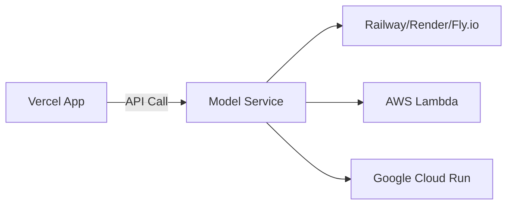

# Vercel Deployment Solution for Banking Risk RAG

## Why Current Solution Won't Work on Vercel

### Vercel Limitations:
1. **50MB Function Size Limit**: PyTorch alone is ~800MB
2. **10-second Timeout**: Model loading takes longer
3. **No Persistent Storage**: Can't store FAISS index
4. **No Python Runtime**: Limited to Node.js for API routes
5. **No Binary Execution**: Can't run Python subprocess

## Solution Options

### Option 1: JavaScript-Based RAG (Recommended for Vercel)

```typescript
// Use TensorFlow.js or ONNX.js for client-side inference
import * as tf from '@tensorflow/tfjs'
import { Pipeline } from '@xenova/transformers'

// Lightweight embeddings using Transformers.js
const embedder = await Pipeline('feature-extraction', 'Xenova/all-MiniLM-L6-v2')

// Vector search using vectra (JavaScript vector DB)
import { LocalIndex } from 'vectra'
const index = new LocalIndex('./vectors')
```

### Option 2: Edge Runtime with WebAssembly

```typescript
// Use Vercel Edge Runtime with WASM
export const runtime = 'edge'

import init, { BankingRiskModel } from './banking_risk_wasm'

export async function POST(request: Request) {
  await init()
  const model = new BankingRiskModel()
  // Limited to 1MB model size
}
```

### Option 3: External API Service (Best Performance)

Deploy the Python model separately and call it from Vercel:



## Recommended Solution: Hybrid Approach

### 1. Client-Side Search Enhancement (Immediate)

```typescript
// /src/lib/rag/client-search.ts
import { pipeline } from '@xenova/transformers'

export class ClientSideBankingSearch {
  private classifier: any
  private embedder: any
  
  async initialize() {
    // Load small models that run in browser
    this.classifier = await pipeline(
      'text-classification',
      'Xenova/distilbert-base-uncased-finetuned-sst-2-english'
    )
    
    this.embedder = await pipeline(
      'feature-extraction',
      'Xenova/all-MiniLM-L6-v2'
    )
  }
  
  async classifyRisk(text: string) {
    // Simple risk classification
    const riskKeywords = {
      HIGH: ['critical', 'severe', 'immediate', 'breach'],
      MEDIUM: ['moderate', 'concern', 'review'],
      LOW: ['minimal', 'low', 'acceptable']
    }
    
    const textLower = text.toLowerCase()
    for (const [level, keywords] of Object.entries(riskKeywords)) {
      if (keywords.some(k => textLower.includes(k))) {
        return level
      }
    }
    return 'MEDIUM'
  }
  
  async getEmbedding(text: string) {
    const output = await this.embedder(text, {
      pooling: 'mean',
      normalize: true
    })
    return Array.from(output.data)
  }
}
```

### 2. Serverless-Compatible Vector Search

```typescript
// /src/lib/rag/lightweight-search.ts
import Fuse from 'fuse.js' // Fuzzy search
import { encode } from 'gpt-tokenizer'

export class LightweightBankingRAG {
  private fuseIndex: Fuse<any>
  private documents: Map<string, any>
  
  constructor() {
    // Initialize with banking-specific options
    const fuseOptions = {
      keys: [
        { name: 'title', weight: 0.3 },
        { name: 'content', weight: 0.2 },
        { name: 'riskTerms', weight: 0.5 }
      ],
      threshold: 0.4,
      includeScore: true
    }
    
    this.documents = new Map()
    this.fuseIndex = new Fuse([], fuseOptions)
  }
  
  processDocument(doc: any) {
    // Extract banking risk terms
    const riskTerms = this.extractRiskTerms(doc.content)
    
    const processedDoc = {
      ...doc,
      riskTerms: riskTerms.join(' '),
      riskLevel: this.assessRiskLevel(doc.content),
      compliance: this.detectCompliance(doc.content)
    }
    
    this.documents.set(doc.id, processedDoc)
    this.fuseIndex.add(processedDoc)
  }
  
  private extractRiskTerms(content: string): string[] {
    const bankingTerms = [
      'basel iii', 'tier 1 capital', 'liquidity coverage ratio',
      'credit risk', 'market risk', 'operational risk',
      'var', 'cvar', 'stress testing', 'counterparty',
      'default', 'exposure', 'hedge', 'derivative'
    ]
    
    const found: string[] = []
    const contentLower = content.toLowerCase()
    
    bankingTerms.forEach(term => {
      if (contentLower.includes(term)) {
        found.push(term)
      }
    })
    
    return found
  }
  
  private assessRiskLevel(content: string): string {
    const high = /critical|severe|immediate|urgent/i
    const medium = /moderate|significant|attention/i
    const low = /minimal|low|acceptable/i
    
    if (high.test(content)) return 'HIGH'
    if (medium.test(content)) return 'MEDIUM'
    return 'LOW'
  }
  
  private detectCompliance(content: string): string[] {
    const frameworks = {
      'BASEL_III': /basel\s*(iii|3)|capital\s*adequacy/i,
      'SOX': /sarbanes|sox|internal\s*controls/i,
      'GDPR': /gdpr|data\s*protection|privacy/i,
      'AML': /anti.*money.*laundering|aml|kyc/i
    }
    
    return Object.entries(frameworks)
      .filter(([_, regex]) => regex.test(content))
      .map(([framework]) => framework)
  }
  
  search(query: string, options?: any) {
    // Enhance query with banking context
    const enhancedQuery = this.enhanceQuery(query)
    
    // Perform search
    const results = this.fuseIndex.search(enhancedQuery)
    
    // Post-process with risk ranking
    return this.rankByRisk(results, query)
  }
  
  private enhanceQuery(query: string): string {
    // Add synonyms and related terms
    const synonyms: Record<string, string[]> = {
      'risk': ['exposure', 'threat', 'vulnerability'],
      'compliance': ['regulatory', 'requirement', 'mandate'],
      'capital': ['tier 1', 'tier 2', 'buffer']
    }
    
    let enhanced = query
    Object.entries(synonyms).forEach(([term, syns]) => {
      if (query.toLowerCase().includes(term)) {
        enhanced += ' ' + syns.join(' ')
      }
    })
    
    return enhanced
  }
  
  private rankByRisk(results: any[], query: string) {
    // Boost high-risk documents if query suggests urgency
    const urgentQuery = /urgent|critical|immediate|asap/i.test(query)
    
    return results
      .map(result => {
        const doc = result.item
        let score = result.score || 0
        
        // Boost high-risk documents for urgent queries
        if (urgentQuery && doc.riskLevel === 'HIGH') {
          score *= 0.7 // Lower score is better in Fuse.js
        }
        
        // Boost if compliance frameworks match
        if (query.match(/basel|sox|gdpr|aml/i)) {
          const matches = doc.compliance.some((c: string) => 
            query.toLowerCase().includes(c.toLowerCase())
          )
          if (matches) score *= 0.8
        }
        
        return { ...result, score, document: doc }
      })
      .sort((a, b) => a.score - b.score)
  }
  
  generateSummary(results: any[]): string {
    const riskCounts = { HIGH: 0, MEDIUM: 0, LOW: 0 }
    const complianceMap = new Map<string, number>()
    
    results.forEach(r => {
      const doc = r.document
      riskCounts[doc.riskLevel]++
      doc.compliance.forEach((c: string) => {
        complianceMap.set(c, (complianceMap.get(c) || 0) + 1)
      })
    })
    
    let summary = `Found ${results.length} documents:\n\n`
    
    if (riskCounts.HIGH > 0) {
      summary += `⚠️ ${riskCounts.HIGH} HIGH RISK documents require attention\n`
    }
    
    summary += `Risk Distribution: High(${riskCounts.HIGH}), Medium(${riskCounts.MEDIUM}), Low(${riskCounts.LOW})\n\n`
    
    if (complianceMap.size > 0) {
      summary += 'Compliance Coverage:\n'
      complianceMap.forEach((count, framework) => {
        summary += `• ${framework}: ${count} documents\n`
      })
    }
    
    return summary
  }
}
```

### 3. Vercel-Compatible API Route

```typescript
// /src/app/api/rag/vercel-search/route.ts
import { NextRequest, NextResponse } from 'next/server'
import { LightweightBankingRAG } from '@/lib/rag/lightweight-search'
import { getServerSession } from 'next-auth'
import { authOptions } from '@/lib/auth'
import { prisma } from '@/lib/db'

// Initialize RAG (will be cached by Vercel)
const rag = new LightweightBankingRAG()
let initialized = false

async function initializeRAG() {
  if (initialized) return
  
  // Load all documents into memory (for small datasets)
  const documents = await prisma.document.findMany({
    where: { isActive: true },
    take: 1000 // Limit for memory
  })
  
  documents.forEach(doc => {
    rag.processDocument({
      id: doc.id,
      title: doc.title,
      content: `${doc.title} ${doc.description} ${doc.tags || ''}`,
      metadata: {
        category: doc.category,
        createdAt: doc.createdAt
      }
    })
  })
  
  initialized = true
}

export async function POST(request: NextRequest) {
  try {
    const session = await getServerSession(authOptions)
    if (!session?.user) {
      return NextResponse.json({ error: 'Unauthorized' }, { status: 401 })
    }
    
    await initializeRAG()
    
    const { query, filters } = await request.json()
    
    // Perform search
    const results = rag.search(query, filters)
    
    // Generate summary
    const summary = rag.generateSummary(results.slice(0, 10))
    
    // Format response
    return NextResponse.json({
      results: results.slice(0, 20),
      summary,
      searchType: 'vercel_optimized_rag'
    })
    
  } catch (error) {
    console.error('Search error:', error)
    return NextResponse.json(
      { error: 'Search failed' },
      { status: 500 }
    )
  }
}
```

### 4. Database-Driven Embeddings (Best for Vercel)

```typescript
// Store pre-computed embeddings in database
// prisma/schema.prisma
model DocumentEmbedding {
  id         String   @id @default(cuid())
  documentId String   @unique
  embedding  String   // JSON array of numbers
  riskLevel  String
  compliance String   // JSON array
  createdAt  DateTime @default(now())
  
  document Document @relation(fields: [documentId], references: [id])
  
  @@index([riskLevel])
  @@map("document_embeddings")
}
```

```typescript
// Pre-compute embeddings during document upload
export async function processDocumentForSearch(documentId: string) {
  const doc = await prisma.document.findUnique({
    where: { id: documentId }
  })
  
  if (!doc) return
  
  // Use edge function to compute embeddings
  const response = await fetch('/api/embeddings/generate', {
    method: 'POST',
    body: JSON.stringify({
      text: `${doc.title} ${doc.description}`
    })
  })
  
  const { embedding, riskLevel, compliance } = await response.json()
  
  // Store in database
  await prisma.documentEmbedding.create({
    data: {
      documentId,
      embedding: JSON.stringify(embedding),
      riskLevel,
      compliance: JSON.stringify(compliance)
    }
  })
}
```

## Recommended Deployment Strategy

### For Vercel:
1. **Use Lightweight JavaScript Models** (Transformers.js)
2. **Pre-compute embeddings** during upload
3. **Store vectors in database** (PostgreSQL with pgvector)
4. **Client-side enhancement** for better UX
5. **Fuzzy search fallback** for reliability

### For Full Python Model:
Deploy on:
- **Railway**: $5/month, easy Python deployment
- **Fly.io**: Great for containerized apps
- **AWS Lambda**: Using container images (up to 10GB)
- **Google Cloud Run**: Serverless containers

### Example External API Architecture:

```typescript
// Vercel app calls external model service
const BANKING_MODEL_API = process.env.BANKING_MODEL_API_URL

export async function searchWithBankingRAG(query: string) {
  const response = await fetch(`${BANKING_MODEL_API}/search`, {
    method: 'POST',
    headers: {
      'Authorization': `Bearer ${process.env.MODEL_API_KEY}`,
      'Content-Type': 'application/json'
    },
    body: JSON.stringify({ query })
  })
  
  return response.json()
}
```

## Migration Path

1. **Phase 1**: Deploy with JavaScript-based search (works on Vercel)
2. **Phase 2**: Add external Python model API (better accuracy)
3. **Phase 3**: Migrate to edge computing when available

This approach gives you immediate functionality on Vercel while allowing future upgrades to more sophisticated models.